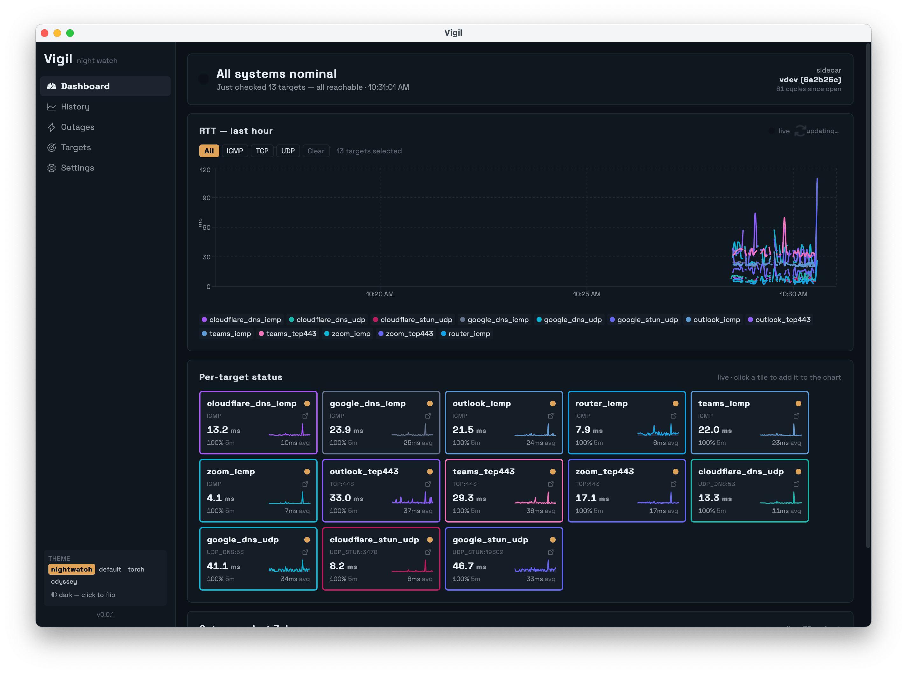
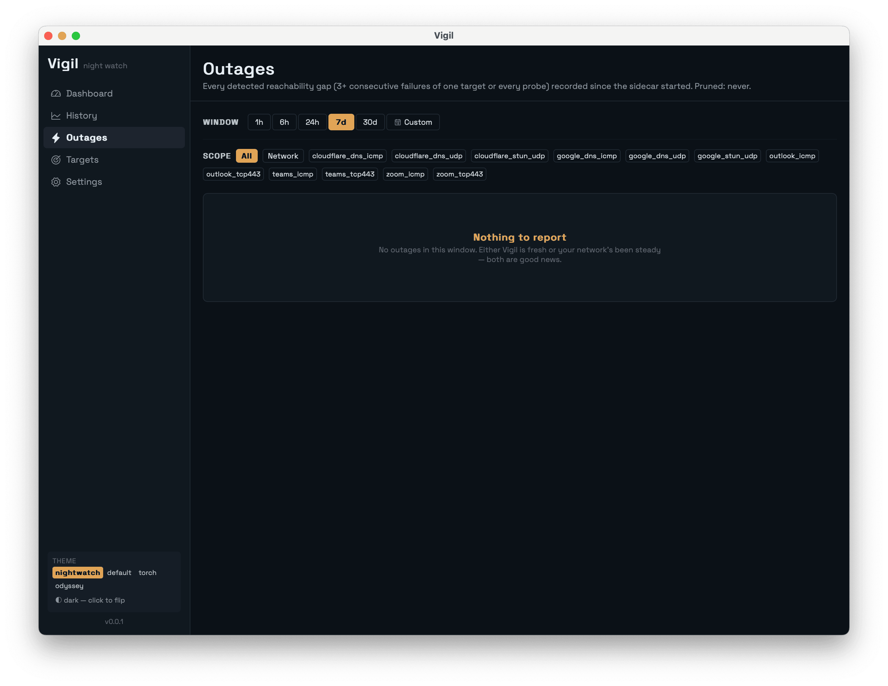
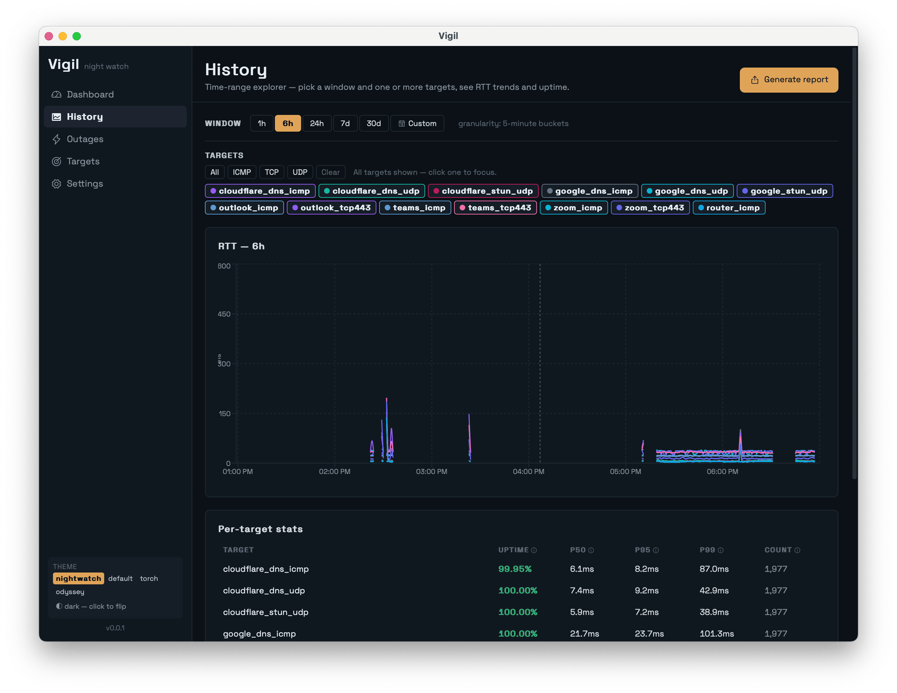

# Vigil

Continuous network reliability monitor with a desktop UI. Pings your router, anycast DNS, and real call-quality endpoints (Teams, Zoom, Outlook) on a fixed interval. Samples Wi-Fi signal. Detects outages. Generates the receipts you hand your ISP or property manager when they tell you the network is fine.

Lives in the system tray. Works on macOS, Windows, and Linux.

> *Vigil* — from the Roman *Vigiles*, Rome's night watch. Built because an ISP and a managed property couldn't give a straight answer.

## Screenshots

### Dashboard — is the network ok right now?

Live RTT chart over the last 15 minutes, per-target status tiles, and a status banner that turns red the moment three consecutive failures land.



### Outages — the receipts

Every detected outage with exact start/end timestamps, duration, consecutive-failure count, and error-code breakdown. This is the page you screenshot when your ISP says "everything's fine."



### History — time-range explorer

Pick any window from 1 hour to 30 days. RTT trend, uptime %, p50/p95/p99 latency, and per-target stats. Generate CSV / JSON / HTML reports from any view.



## Install

Download the latest release from [GitHub Releases](https://github.com/sid-technologies/vigil/releases/latest). Pick the file for your OS:

| OS | File | Notes |
|---|---|---|
| macOS Apple Silicon (M1 / M2 / M3 / M4) | `Vigil_<version>_aarch64.dmg` | |
| macOS Intel | `Vigil_<version>_x64.dmg` | |
| Windows 10/11 (x64) | `Vigil_<version>_x64-setup.msi` | Installer |
| Linux (Debian / Ubuntu) | `vigil_<version>_amd64.deb` | `sudo dpkg -i vigil_*.deb` |
| Linux (everything else) | `vigil_<version>_amd64.AppImage` | `chmod +x` then run |

### macOS

1. Open the `.dmg` and drag **Vigil.app** to your **Applications** folder.
2. Open Applications, double-click Vigil.

**If you see "Vigil can't be opened because Apple cannot check it for malicious software":** that means this build is unsigned. Open **System Settings → Privacy & Security**, scroll to the bottom, and click **"Open Anyway"** next to the Vigil notice. Confirm in the prompt that follows. After this first time, Vigil opens normally on every launch.

(Signed builds skip this step entirely.)

### Windows

1. Run the `.msi` installer. Defender SmartScreen may show **"Windows protected your PC"** if the build is unsigned.
2. Click **More info → Run anyway**.
3. Walk through the installer (one screen, no choices to make).
4. Vigil launches automatically; check the system tray (bottom-right corner).

### Linux

**.deb (Ubuntu, Debian, Mint, Pop!_OS):**

```bash
sudo dpkg -i vigil_*_amd64.deb
sudo apt-get install -f   # if dependency errors, this resolves them
```

**.AppImage (Fedora, Arch, NixOS, anything else):**

```bash
chmod +x Vigil_*_amd64.AppImage
./Vigil_*_amd64.AppImage
```

ICMP probes use unprivileged ICMP sockets. On Ubuntu / Fedora this works without sudo for any user; on locked-down distros you may need to add yourself to `net.ipv4.ping_group_range`.

## First launch

1. **The dashboard begins probing immediately** — every 2.5 seconds, 13 default targets (router + Google/Cloudflare DNS + Teams/Zoom/Outlook + STUN). Within seconds you'll see "Last cycle: 13/13 ok" if everything's healthy.
2. **Vigil lives in the tray** — close the window and it keeps probing in the background. Right-click the tray icon for Show / Hide / Open data folder / Launch on login / Quit.
3. **Outages auto-detect** — three consecutive failures of the same target trigger an outage event. Lose Wi-Fi for ten seconds and the dashboard goes red.
4. **Generate a report** any time — History page → *Generate report*. Pick CSV / JSON / HTML, choose a folder. The HTML report is a self-contained dashboard you can email to your ISP.

Data lives in:

- **macOS**: `~/Library/Application Support/dev.vigil.desktop/`
- **Windows**: `%APPDATA%\dev.vigil.desktop\`
- **Linux**: `~/.local/share/dev.vigil.desktop/`

The tray menu has an **"Open data folder"** shortcut.

### Keyboard shortcuts

Press `Shift+?` from anywhere in the app to see the full shortcut overlay. The essentials:

- `⌘1` … `⌘5` (`Ctrl+…` on Windows / Linux) — jump between Dashboard, History, Outages, Targets, Settings
- `⌘S` — save Settings
- `Esc` — close any modal

## What's where

```
cmd/vigil-sidecar/        Entry point for the Go sidecar
internal/                 Sidecar internals (probes, monitor, aggregator, IPC, storage)
pkg/                      Reusable Go packages (errors, log, buildinfo)
db/ent/schema/            Ent schemas (single source of truth for the SQLite layout)
apps/desktop/             Tauri shell + React frontend
packages/configs/         Tamagui config, theme controller, fonts
scripts/                  Build + release helpers
.github/workflows/        CI + release pipelines
```

The desktop app is a Tauri 2.x shell wrapping a Go sidecar over stdio JSON-RPC. The sidecar owns the probe loop, SQLite, aggregation, and outage detection. The shell handles tray, window lifecycle, and the auto-updater. See [`CLAUDE.md`](./CLAUDE.md) for the full architecture, conventions, and release runbook.

## Development

### Prerequisites

- Go 1.25+
- Node 20+ and pnpm 10+
- Rust toolchain (rustup), plus Tauri 2.x prerequisites for your OS — see https://tauri.app/start/prerequisites/

### Quick start

```bash
# Install JS deps
pnpm install

# Generate Ent code (only needed first time / after schema changes)
make gen-ent

# Build the Go sidecar for the host platform and drop it where Tauri expects it
make build-sidecar

# Run the desktop app in dev mode (Vite + Tauri)
make desktop-dev
```

### Make targets

Run `make help` to see them all. The frequently-used ones:

- `make gen-ent` — Run Ent codegen after editing schemas in `db/ent/schema/`.
- `make build-sidecar` — Cross-compile the Go sidecar for the host platform.
- `make desktop-dev` — Start Vite + Tauri in dev mode (depends on `build-sidecar`).
- `make desktop-build` — Production bundle (.dmg / .msi / AppImage).
- `make desktop-icons` — Regenerate all Tauri icon sizes from `apps/desktop/app-icon.png`.
- `make lint` — Run all linters via pre-commit.
- `make test` — Run Go tests.

## Contributing

Issues and PRs welcome. A few ground rules:

- Keep the watchman voice — Vigil reports state matter-of-factly. No alarm-emoji panic, no gamification, no condescension.
- Sidecar logs go to a file in the OS app-data dir. Stdout is reserved for IPC; never `fmt.Println` from the sidecar.
- Probe defaults are conservative on purpose (2.5 s cadence, 2 s timeout). Don't tighten them without a reason — Vigil's job is to *not* be the thing degrading the network.
- See [`CLAUDE.md`](./CLAUDE.md) for architecture, conventions, and the release runbook.

## License

MIT. See [`LICENSE`](./LICENSE).

## Credits

Built and maintained by [SID Technologies](https://github.com/sid-technologies). Vigil is one of SID's open-source tools — see also [Pilum](https://github.com/sid-technologies/pilum) (multi-cloud deployment CLI).
